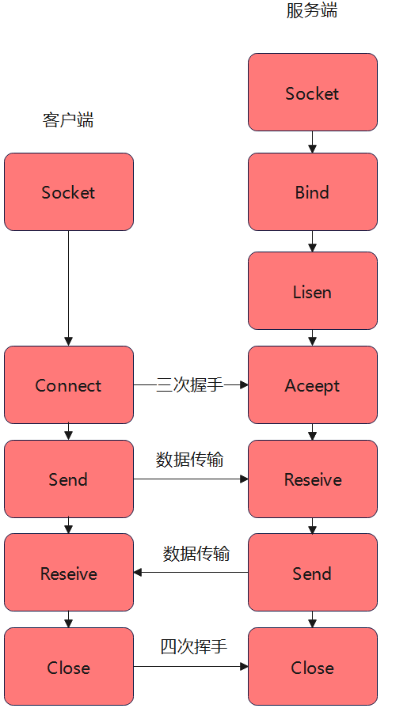
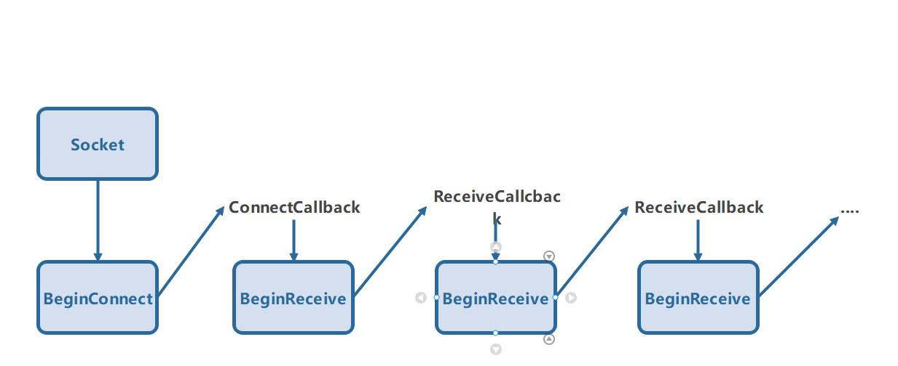
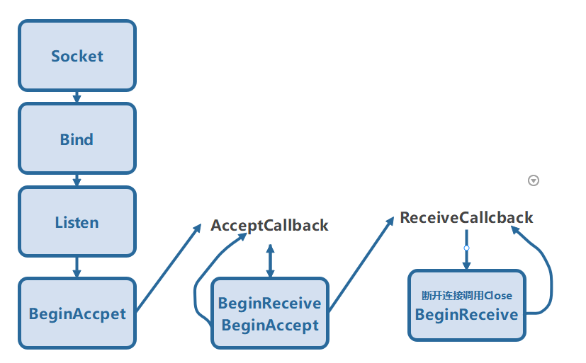
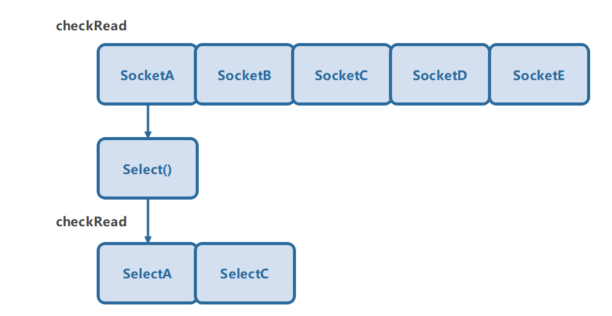
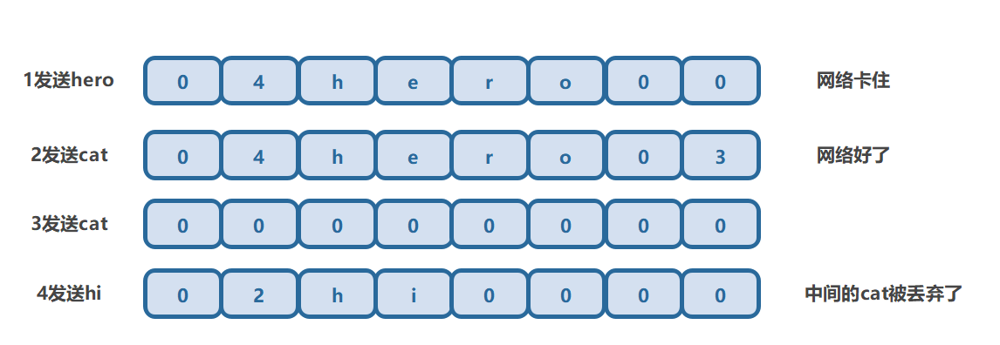
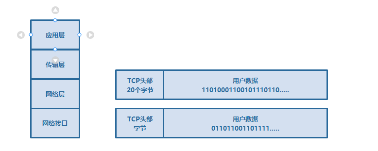
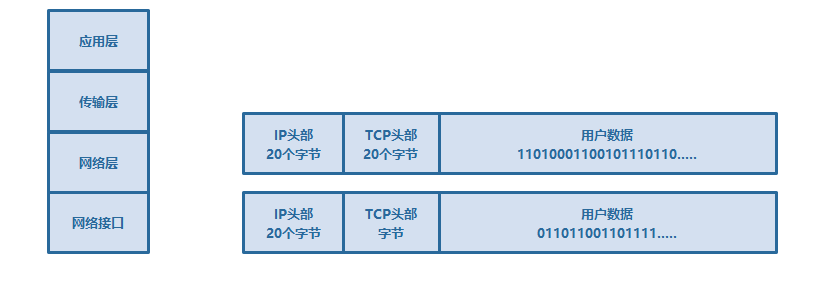
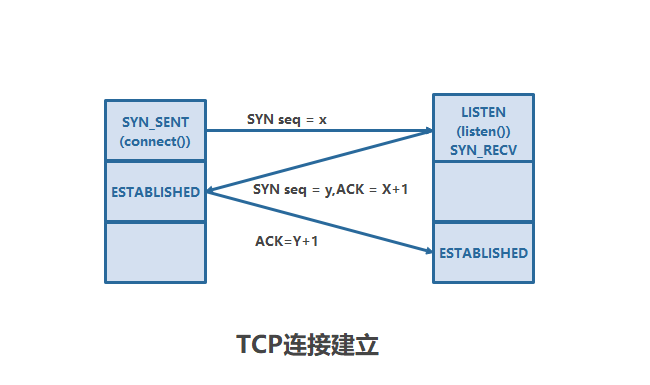
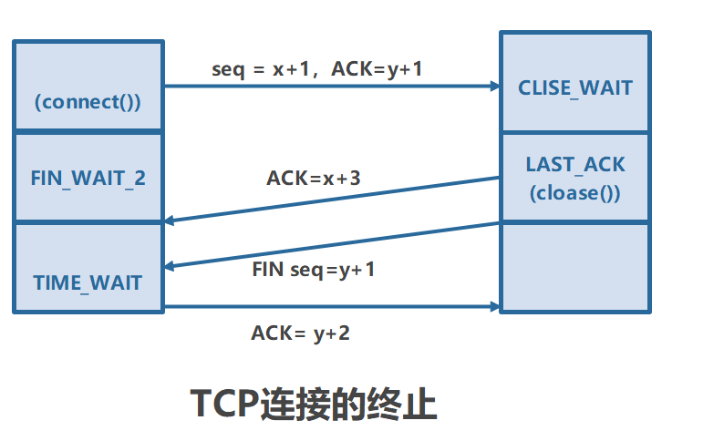
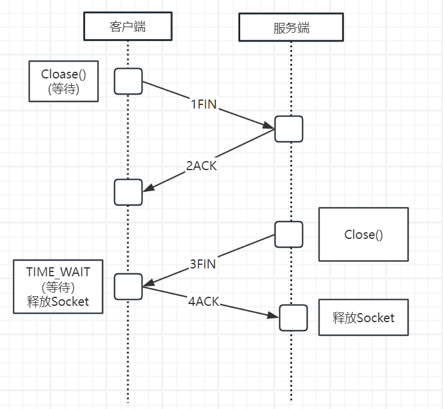

# Socket介绍

网络上的两个程序通过一个双向的通信连接实现数据交互，这个连接的一段就是Socket，一个Socket包含了五个必须的信息。

```c#
    /*使用的连接协议:TCP、UDP
     *本地IP:192.168.200.11
     *本地端口：1000
     *远程IP:192.168.200.11
     *远程端口：800
     *
    */
```

## `IP`

​	`IP`是用于标识一台计算机的虚拟编号，网络层的`IP`协议是点到点的协议。

## `port`

 	`port`即端口，每台计算机可以分配`0~65535`个，是与外界交互的接口，`TCP、UDP`是传输层的端到端的协议， `Socket`每个都是一台计算机的一个端口到另一台计算机的一个端接口。

### `TCP`

​	面向连接的，可靠的基于字节流的传输层协议

### `UDP`

​	相对`TCP`面向无连接的，不可靠的，但传输效率较高的协议

# 通信流程



# `Socke`常用同步函数

## 通用

### 连接`Connect`

​	客户端通过`socket.Connect`(远端`IP`地址，远端`IP`端口)连接服务器。`Connect`是一个阻塞方法，会卡住知道服务器回应(接收、拒绝、超时)

### 发送信息Send

​	客户端通过`socket.send`发送信息，也是阻塞方法，参数为byte[],send返回发送的字节长度，可使用    `Systeam.Text.Encoding.Defauit.`

`GetString(readBuff,0,count)` 将字节转换成字符串。

### 接受信息Receive

​	客户端通过`socket.Receive()`接受数据，也是阻塞方法，带有一个byte[]参数,返回接受的长度。

### 关闭Close

​	`socket.Close()`关闭连接

## 服务端

### 绑定Bind

​	`listen.Bind(ipEp)`将`listenfd`套接字绑定`IP`和端口，程序中绑定本地地址“`127.0.0.1”和8888，127.0.0.1`是回环地址，指本机，一般用于测试

### 监听Listen

​	`listenfd.Listen(backlog)`开启监听，等待客户端连接，`backlog`为最大连接数，0为不限制

### 应答Accept

​	开机监听后服务器使用`listenfd.Accept`接受客户端连接，以上使用所有Socket方法都是阻塞，没有客户端连接，`listenfd.Accept`会卡住，

知道客户端连接，`Accept`返回连接上来的客户端。

## `IPAddress和IPEndPoint`

​	绑定参数

# `Socket`常用异步函数

## 通用

### 异步`Connect`

```csharp
    public IAsyncResult BeginConnect(
        string host,//IP
        int port,	//端口
        AsyncCallBack resquestCallback,//一个AsynecCallback回调，函数必须是 void ConnectCallback(IAsyncResuit ar)形式
        object state//一个用户定义的对象，可包含需要传递的参数
    )
```

### 异步`Send`

```csharp
    public IAsyncResuit BeginSend(
        byte[] buffer;	//发送数据的字节数组
        int offset;		//发送的开始位置
        int size;		//发送数据的大小
        SocketFlags socketFlags;//socketFlags按位组合，通常为0
        AsyncCallback callback;	//一个AsynecCallback回调
        object state;			//一个用户定义的对象，可包含需要传递的参数
    )
    socket.EndSend();//返回发送了的数据字节
```

### 异步`Reseive`

```csharp
    public IAsyncResult BeginReceive(
        byte[] readBuff,//接受数据存储到的字节数组
        int offset,		//开始存储的位置，最小为0
        int size, 		//最大接受字节
        socketFlagsType socketFlags,//socketFlags按位组合，通常为0
        AsyncCallBack callback,		//一个AsynecCallback回调
        object state	//一个用户定义的对象，可包含需要传递的参数
    )
    socket.EndReceive()//返回收到的数据长度
```



## 服务端

### 异步`Accept`

```csharp
    public IAsyncResuit BeginAccept(
        AsyncCallback callback, //一个AsynecCallback回调
        object state 			//一个用户定义的对象，可包含需要传递的参数
    )
    socket.EndAccept//返回一个Socket
```



# 状态检测和多路复用

## `poll`(状态检测)

什么是`poll`,当使用同步的读写等函数时，会阻塞进程，那么`poll`的作用是在有可读可写的时候才会去调用，`poll`用于监听一个`socket`是否可读或者可写

```csharp
    if(socket 有数据可读)
    {
        socket.Receive();
    }
    if(socket 有数据可写)
    {
        socket.Send();
    }
    if(socket 发生错误)
    {
        socket。close();
    }
```

```csharp
    public bool Poll(
        int microSeconds, //等待回应的时间，以微秒为单位，如果该参数为-1，表示一直等待，如果为0，表示非阻塞
        SelectMode mode	  //有三种可以选择分别如下SlectRead:如果Socket可读，返回true,否则返回false;
                          //SelectWrite:如果可写，返回true，否则返回false;
                          //SelectError:如果连接失败，返回true，否则返回false
    )
```

## Select(多路复用)

`poll`是检测一个Socket的状态，在没有可读可写等情况，会一直循环检测，于是从性能的角度考虑，有了Select(多路复用)，Select检测多个socket，如果有一个可读可写等就会返回可读可写的Socket,如果没有就阻塞。

```csharp
    public static void Select(
        IList checkRead,  	//检测是否有可读的Socket列表
        IList checkWrite,	//检测是否有可写的Socket列表
        IList ckeckError,	//检测是否有可写的列表
        int microSeconds	//等待回应的时间，以微秒为单位，如果该参数为-1，表示一直等待，如果为0表示阻塞。
    )
```



# 多人战斗

## 通信协议

`消息名|参数1，参数2，参数3，参数4.....`

## 事件分发处理消息

```csharp
    //声明一个delegate类型，它必须与要传递的参数具有相同的参数和返回值
    public delegate void MsgListener(String str);
    //监听列表
    private static Dictionary<string, MsgListener> Listeners = new Dictionary<string, MsgListener>();

    public static class NetManager
    {
        //region 添加事件监听
        public static void AddListener(string msgName, MsgListener listener)
        {
            if (false == Listeners.ContainsKey(msgName))
            {
                Listeners[msgName] = listener;
            }
        }

        public static void Update()
        {
             if (msgList.Count <= 0)
             {
                 return;
             }
             String msgStr = null;
             lock (_LockObj)
             {
                 msgStr = msgList[0];
                 msgList.RemoveAt(0);
             }

             string[] split = msgStr.Split('|');

             if (split.Length < 2)
             {
                 return;
             }
             string msgnName = split[0];
             string msgArg = split[1];

             //监听回调
             if (Listeners.ContainsKey(msgnName))
             {
                 Listeners[msgnName](msgArg);
             }
        }
    }


    public class MsgHandler:MonoBehaviour
    {
        private void Awake()
        {
                private void Awake()
        {
            NetManager.AddListener("Enter", OnEnter);
            NetManager.AddListener("Move", OnMove);
            NetManager.AddListener("Leave", OnLeave);
            NetManager.AddListener("List", OnList);
            NetManager.AddListener("Jump", OnJump);
        }
    }
    }

    //在收到服务器的消息时，根据解析的协议名，使用消息队列msgList.add("协议名");


```


## 消息队列

`可以使用List<String> msgList`

## 反射机制

```csharp
    string[] split = recvStr.Split('|');
    string msgName = split[0];
    string funname = "Msg" + msgName； 
    //MethodInfo mi = typeof(函数名).GetMethod(方法吗名)
    MethodInfo mi = typeof(MsgHandler).GetMethod(funName);
    object[] o = {state,msgArgs}
	//静态方法 null代表this
    mi.Invoke(null,o);
```


## 客户端

### 连接

```csharp
    客户端
    Connect->Send->Receive->Send->Receive->......;
    Socket socket;
    //同步
    public void Connect
    {
         //socket
        socket = new Socket(AddressFamily.InterNetwork, SocketType.Stream, ProtocolType.Tcp);
        Socket.Connect("127.0.0.1","8888")
    }
    //异步
    public static void Connection(string ip, int port)
    {
        //socket
        socket = new Socket(AddressFamily.InterNetwork, SocketType.Stream, ProtocolType.Tcp);
        //Connect
        socket.BeginConnect(ip, port, ConnectCallback, socket);
    }
    public static void ConnectCallback(IAsyncResult ar)
    {
        try
        {
            UnityEngine.Debug.Log("Socket Connect Success");
            Socket connectSocket = (Socket)ar.AsyncState;
            connectSocket.EndConnect(ar);
            //BeginReceive
            socket.BeginReceive(readBuff, 0, 1024, 0, ReceiveCallback, socket);
        }
        catch (SocketException e)
        {
            UnityEngine.Debug.Log("Socekt Connect Fail" + e.ToString());
        }
    }
```

### 发送数据

```csharp
    public static void Send(string sendStr)
    {
        if (socket == null) return;
        if (socket.Connected == false) return;
        //内容
        byte[] bodyBytes = System.Text.Encoding.Default.GetBytes(sendStr);
        Int16 bodyLength = (Int16)bodyBytes.Length;
        byte[] lengthBytes = BitConverter.GetBytes(bodyLength);
        //使用小端存储
        if (BitConverter.IsLittleEndian == false)
        {
            lengthBytes.Reverse();
        }
        //记录发送数据
        ByteArray sendByte = new ByteArray(lengthBytes.Concat(bodyBytes).ToArray());

        int count = 0;
        lock (writeQueue)
        {
            writeQueue.Enqueue(sendByte);
            count = writeQueue.Count;
        }
        if (count == 1)
        {
            socket.BeginSend(sendByte.sendByte, 0, sendByte.length, SocketFlags.None, SendCallback, socket);
        }
    }


    public static void SendCallback(IAsyncResult ar)
    {
        try
        {
            Socket sendSocket = (Socket)ar.AsyncState;
            int count = sendSocket.EndSend(ar);
            //剩余发送数据长度 = 原发送的数据的长度 - 数据发送了的长度
            ByteArray byteArray;
            lock (writeQueue)
            {
                byteArray = writeQueue.First();
            }
            byteArray.sendIdx += count;
            byteArray.length -= count;
            if (byteArray.length <= 0)//第一条消息完全发送
            {
                string recvStr = System.Text.Encoding.Default.GetString(byteArray.sendByte, 0, count);
                lock (_LockObj)
                {
                    msgList.Add(recvStr);
                }

                lock (writeQueue)
                {
                    writeQueue.Dequeue();
                    byteArray = writeQueue.Count > 0 ? writeQueue.First() : null;
                }
            }
            if (byteArray != null) //发送不完整 || 发送完整发送第二条
            {
                sendSocket.BeginSend(byteArray.sendByte, byteArray.sendIdx, byteArray.length, SocketFlags.None, SendCallback, 					sendSocket);
            }
        }
        catch (SocketException e)
        {
            UnityEngine.Debug.Log("Socekt Send fail" + e.ToString());
        }
    }
```

### 接受数据

```csharp
    public static void ReceiveCallback(IAsyncResult ar)
    {
        try
        {
            Socket recvSocket = (Socket)ar.AsyncState;
            //接受数据的长度
            int count = recvSocket.EndReceive(ar);
            buffcount += count;
            NetManager.OnReveiveData();
            recvSocket.BeginReceive(readBuff, buffcount, 1024 - buffcount, 0, ReceiveCallback, recvSocket);
        }
        catch (SocketException e)
        {
            UnityEngine.Debug.Log("Socekt Receive fail" + e.ToString());
        }
    }

    public static void OnReveiveData()
    {
        //前两字节为消息类型，小于两字节解析不出 return
        if (buffcount < 2)
        {
            return;
        }
        Int16 bodyLength = (short)(readBuff[1] << 8 | readBuff[0]);
        //没有都到一整条消息 reutrn
        if (buffcount < bodyLength + 2)
        {
            return;
        }
        //开始解析
        string readStr = System.Text.Encoding.Default.GetString(readBuff, 2, bodyLength);
        lock (_LockObj)
        {
            msgList.Add(readStr);
        }
        //清除读取的内容
        int start = 2 + bodyLength;
        int lenth = buffcount - start;
        Array.Copy(readBuff, start, readBuff, 0, lenth);
        buffcount -= start;
        NetManager.OnReveiveData();
    }
```

## 服务端

### 绑定监听

```csharp
    Bind->Listen->Receive->Send->Receive->.....
    static void Main(string[] args)
    {
        listenSocket = new Socket(AddressFamily.InterNetwork, SocketType.Stream, ProtocolType.Tcp);
        //绑定
        IPAddress iPAddress = IPAddress.Parse("127.0.0.1");
        IPEndPoint iPEndPoint = new IPEndPoint(iPAddress, 8888);
        listenSocket.Bind(iPEndPoint);
        //监听
        listenSocket.Listen(0);
        Console.WriteLine("[服务器]启动成功");
        List<Socket> checkRead = new List<Socket>();
        //等待连接
        while (true)
        {
            //RemoveSocket();
            //将所有Socket添加到检测列表
            checkRead.Clear();
            checkRead.Add(listenSocket);
            foreach (ClientState s in clients.Values)
            {
                checkRead.Add(s.socket);
            }
            Socket.Select(checkRead, null, null, 1000);

            foreach (var s in checkRead)
            {
                if (s == listenSocket)
                {
                    ReadListenfd(s);
                }
                else
                {
                    ReadClientfd(s);
                }
            }

        }
    }
```

### 客户端连接

```csharp
    public static void ReadListenfd(Socket listtenfd)
    {
        try
        {
            Socket clientfd = listenSocket.Accept();
            if (clients.ContainsKey(clientfd))
            {
                return;
            }
            ClientState state = new ClientState();
            state.socket = clientfd;
            state.port = clientfd.RemoteEndPoint.ToString();
            clients[clientfd] = state;

            //state.socket.BeginReceive(state.readbuff, 0, 1024, SocketFlags.None, ReceiveCallBack, state.socket);
            Console.WriteLine($"[服务器]客户端：{clientfd.RemoteEndPoint}连接到服务器，当前客户端数量{clients.Count}个");
        }
        catch (SocketException e)
        {
            Console.WriteLine("[服务器]添加客户端失败" + e.ToString());
        }
    }
```


### 客户端发送数据

```csharp
    public static bool ReadClientfd(Socket clientfd)
    {
        if (clients.ContainsKey(clientfd) == false)
        {
            clients.Remove((clientfd));
            Console.WriteLine($"[服务器]客户端：{clientfd.RemoteEndPoint}断开连接，当前客户端数量{clients.Count}个");
            return false;
        }
        ClientState state = clients[clientfd];
        int count = 0;
        try
        {
            count = clientfd.Receive(readBuff, buffcount, 1024 - buffcount, 0);
            buffcount += count;
        }
        catch (ObjectDisposedException ox)
        {
            Console.WriteLine("[服务器]读取客户端数据失败" + ox.ToString());
        }
        catch (SocketException e)
        {
            MethodInfo mei = typeof(EventHandlre).GetMethod("OnDisconnect");
            object[] obj = { state };
            mei.Invoke(null, obj);

            clientfd.Close();
            clients.Remove(clientfd);
            Console.WriteLine("[服务器]读取客户端数据失败" + e.ToString());
            return false;
        }
        if (0 >= count)
        {
            MethodInfo mei = typeof(EventHandlre).GetMethod("OnDisconnect");
            object[] ob = { state };
            mei.Invoke(null, ob);

            return false;
        }
        OnReveiveData(state);

        return true;
    }

    /// <summary>
    /// 客户端数据处理
    /// </summary>
    /// <param name="clientState"></param>
    public static void OnReveiveData(ClientState clientState)
    {
        //前两字节为消息类型，小于两字节解析不出 return
        if (buffcount < 2)
        {
            return;
        }
        //解析小端存储的长度数据
        Int16 bodyLength = (short)(readBuff[1] << 8 | readBuff[0]);
        //没有都到一整条消息 reutrn
        if (buffcount < bodyLength + 2)
        {
            return;
        }
        //开始解析
        string readStr = System.Text.Encoding.Default.GetString(readBuff, 2, bodyLength);
        string[] split = readStr.Split('|');
        string msgName = split[0];
        string msgArgs = split[1];

        string funName = "Msg" + msgName;
        //反射获取方法
        MethodInfo mi = typeof(MsgHandler).GetMethod(funName);
        object[] o = { clientState, msgArgs };
        //静态方法 null代表this
        mi.Invoke(null, o);
        //清除读取的内容
        int start = 2 + bodyLength;
        int lenth = buffcount - start;
        Array.Copy(readBuff, start, readBuff, 0, lenth);
        buffcount -= start;
        OnReveiveData(clientState);
    }
```

# 正确收发数据

## 分包粘包

由于操作系统层面是有一个接受缓冲区和发送缓冲区，由于保证TCP协议的高效性，是会在发送缓冲区满的时候发送数据，所以导致了多个包一起发送，就不能实现接受一条处理一条，分包则是缓冲区的大小有限，在不能一次性发完时，会分成几个包发送，这就是分包

## 解决方案


- 长度信息法
- 固定长度法
- 结束符号法

### 长度信息法

在发送数据时前面多加两个字节，存储消息的长度，大部分的游戏网络消息的长度很难超过两个字节，因为16无符号是0~65535.所以16位比较适合。

核心思想：定义一个缓冲区 (`readbuff`)和有效数据长度变量(`buffCount`)

### 固定长度法

规定每个消息的长度为一个固定值，在消息大于固定值时，以将前面的数据存起来，在第二条来时进行拼接。

### 结束符号法

以固定的结束符号表示不同的消息

## 长度信息法处理分包粘包

### 发送方1

```csharp
    //内容
    byte[] bodyBytes = System.Text.Encoding.Default.GetBytes(sendStr);
    Int16 bodyLength = (Int16)bodyBytes.Length;
    byte[] lengthBytes = BitConverter.GetBytes(bodyLength);
```

### 接受方

```csharp
    //前两字节为消息类型，小于两字节解析不出 return
    ReadData()
    {

        if (buffcount < 2)
        {
            return;
        }
        //解析小端存储的长度数据
        Int16 bodyLength = (short)(readBuff[1] << 8 | readBuff[0]);
        //没有都到一整条消息 reutrn
        if (buffcount < bodyLength + 2)
        {
            return;
        }
        //开始解析
        string readStr = System.Text.Encoding.Default.GetString(readBuff, 2, bodyLength);
        string[] split = readStr.Split('|');
        string msgName = split[0];
        string msgArgs = split[1];

        string funName = "Msg" + msgName;
        //反射获取方法
        MethodInfo mi = typeof(MsgHandler).GetMethod(funName);
        object[] o = { clientState, msgArgs };
        //静态方法 null代表this
        mi.Invoke(null, o);
        //清除读取的内容
        int start = 2 + bodyLength;
        int lenth = buffcount - start;
        Array.Copy(readBuff, start, readBuff, 0, lenth);
        buffcount -= start;
        OnReveiveData(clientState);
    }
```

### 大段小端

因为在不同的电脑上处理数据的方式不一样，大多数使用小端存储。就会造成数据长度读取有误。

大端：高位存在低地址

小端：高位存在高地址

```csharp
    if(!BitConverter.IsLittleEndian)
    {
        Debug.Log("[Send]Receive lenBytes")
        lenBytes.Reverse();
    }
```

```csharp
还原数值
    Int16 bodyLength = (short)((readBuff[1] << 8) | readbuff[0]);
```


### 发送错误1



### 发送方2(解决上述问题)

```csharp
	//writeQueue是一个发送缓冲区队列，为啥用队列，因为队列插入和删除的时间复杂度为O(1)
	public class ByteArray
    {
        byte[] sendByte = new byte[1024];//发送缓冲区
        int sendIdx;					 //发送数据的开始位置
        int length;						 //发送数据的剩余长度
	}
   	public static void Send(string sendStr)
    {
        if (socket == null) return;
        if (socket.Connected == false) return;
        //内容
        byte[] bodyBytes = System.Text.Encoding.Default.GetBytes(sendStr);
        Int16 bodyLength = (Int16)bodyBytes.Length;
        byte[] lengthBytes = BitConverter.GetBytes(bodyLength);
        //使用小端存储
        if (BitConverter.IsLittleEndian == false)
        {
            lengthBytes.Reverse();
        }
        //记录发送数据
        ByteArray sendByte = new ByteArray(lengthBytes.Concat(bodyBytes).ToArray());

        int count = 0;
        lock (writeQueue)
        {
            writeQueue.Enqueue(sendByte);
            count = writeQueue.Count;
        }
        if (count == 1)
        {
            socket.BeginSend(sendByte.sendByte, 0, sendByte.length, SocketFlags.None, SendCallback, socket);
        }
    }


    public static void SendCallback(IAsyncResult ar)
    {
        try
        {
            Socket sendSocket = (Socket)ar.AsyncState;
            int count = sendSocket.EndSend(ar);
            //剩余发送数据长度 = 原发送的数据的长度 - 数据发送了的长度
            ByteArray byteArray;
            lock (writeQueue)
            {
                byteArray = writeQueue.First();
            }
            byteArray.sendIdx += count;
            byteArray.length -= count;
            if (byteArray.length <= 0)//第一条消息完全发送
            {
                string recvStr = System.Text.Encoding.Default.GetString(byteArray.sendByte, 0, count);
                lock (_LockObj)
                {
                    msgList.Add(recvStr);
                }

                lock (writeQueue)
                {
                    writeQueue.Dequeue();
                    byteArray = writeQueue.Count > 0 ? writeQueue.First() : null;
                }
            }
            if (byteArray != null) //发送不完整 || 发送完整发送第二条
            {
                sendSocket.BeginSend(byteArray.sendByte, byteArray.sendIdx, byteArray.length, SocketFlags.None, SendCallback, 					sendSocket);
            }
        }
        catch (SocketException e)
        {
            UnityEngine.Debug.Log("Socekt Send fail" + e.ToString());
        }
    }
```

# 深入了解`Socket`

## 传输层

`TCP`遵循下左的传输模型，一层层加工数据，其中网络层有一些限制，每个包的最大的数据量是65535字节，同时它发送数据有可能丢包，`TCP`就是在网络层的(IP的基础上)增加了数据拆分(把TCP数据分成多个`IP`包)确认重传，流量控制，等机制。



## 网络层

`IP`协议会给`TCP`数据添加本地地址、目的地址等信息。



## 网络接口

在多层的处理后，数据通过物理介质(如电缆、光纤)传输到接受方，接受方再依照相反的过程解析，得到用户数据，实际上，`IP`协议还会分封装成更为底层的链路层协议，已完成数据校验等一些功能。

## `TCP`建立

### 三次握手

连接方法调用`Connect`后，`Client`(连接方)向`Sever`(监听方)发送一个数据包`SYN`，`SYN`包含序列号`seq`,这是以后要传输数据时要使用的，`Sever`收到数据包后由标志位`SYN`知道`Client`请求连接，`Sever`将`SYN/ACK`数据包发送给`Client`以确认连接申请，`Clients` 收到`SYN/ACK`数据包后`Connect`返回，连接成功，网络不好的情况下可能要10多秒才返回，这是因为底层一直在等待和尝试发送`SYN`或则`SYN/ACK`包，知道建立连接或则超出重试次数，等到`Sever`收到`ACK`包，将连接状态设置成`ESTABLISHED,`表示成功建立连接



### 四次挥手

第一次挥手：主机1(客户端或服务端)向主机2发送一个终止信号`(FIN)`,此时，主机1进入`FIN_WAIT_1`状态，它没有需要发送的数据，等待着主机2的回应。

第二次挥手：主机2收到主机1发送的终止信号 `(FIN)`,向主机1回应一个`ACK`，收到`ACK`的主机进入`FIN_WAIT_2`。

第三次挥手：主机2在把所有的数据发送完毕后，主机2向主机1发送一个终止信号`(FIN)`,请求关闭连接。

第三次挥手：主机1收到主机2发送的终止信号`(FIN)`，向主机2回应`ACK,`然后主机1进入`TIME_WAIT`状态(等待一段时间，以便处理主机2的重发数据)。主机2收到主机1的回应，关闭连接，至此，`TCP`四次挥手完成。



## `TCP`传输数据

`TCP`发送一个数据后，发送方并不能确保数据被对方接受，于是发送方会等待接收方的回应，如果长时间没有回应，发送方会重新发送数据，发送数据时，`TCP`会考虑对方缓冲区的容量，当对方缓冲区满的时候，会暂停发送数据，防止对方溢出，`TCP`还会根据数据返回的时间判断网络是否拥堵，如果拥堵就减缓发送的速度。(流量控制、拥塞控制)

## 常见`TCP`参数

### `ReceiveBufferSize`

操作系统规定了缓冲区的大小，默认是8192，接收缓冲区满了，发送方会暂停发送数据，接收缓冲区越大，可以减少发送的暂停次数，提高发送效率。

### `SendBufferSize`

操作系统规定了缓冲区的大小，也是默认是8192，如果没有处理好“完整发送数据”，可以将`SendBuffSize`设置成较大的值。

### `NoDelay`

指定发送数据是否使用`Nagle`算法，对于实时性比较高的游戏，该值需要设置成`true`,`Nagle`是一种节流量的机制，默认情况下，`TCP`会使用`Nagle`算法去发送数据。`Nagle`算法机制在于，如果发送端欲多次发送包含少量字节的数据包时，发送端不会立马发送数据，而是积攒到了一定的数量后再将其组成一个较大的数据包发送过去，它会降低网络的实时性，不使用可以将socket。`NoDelay = true`

### `TTL`

`TTL`是值发送的`IP`数据包的生存时间值`(Time To Live,TTL`).TTL是`IP`头部的一个值，该值表示`IP`数据报能够经过最大路由器跳数，发送数据时，`TTL`默认是64(`TTL`的默认值与操作系统有关，`Window Xp`默认值是128，`Windows7`为64，`Windos10`默认值为65，`Linux`默认值为255),在网络传输时`TTL=0`时，会丢弃数据，可以使用`socket.ttl=xxx`来增大跳数

### `ReuseAddress`

端口复用，让一个端口可以被多个`socket`使用，一般情况下，一个端口只能由一个进程独占，假设服务端程序都绑定了1234端口，若开启两个服务器程序，第一个可以成功，但是第二个会提示无法绑定，在计算机中，退出程序和释放端口并不同步，`TCP`断开会四次挥手，在网络不好使，多次断开会导致服务器崩溃，但是又不能立马释放`socket`,,可能等10多分钟才可以重启，所以可以端口复用解决该问题。

```csharp
    Socket socket = new socket(AddressFamily.InterNetWork,SocketType.Stream,ProtocolType.Tcp);
    socket.SetSocketOption(SocketOptionLevel.Socket,SocketOpName.ReuseAddress,true); //设置端口复用
```

### `LingerState`

`LingerState`的功能是套接字保持连接的时间。在四次挥手时，在客户端收到服务端的`3FIN`信号后，会进入一个`TIME_WAIT`状态，等待一段时间后(`Windos`默认4分钟)才会释放`socket`资源，真正的完成关闭连接，`TIME_WAIT`的意义在于网络不好时，迟迟没有收到客户端`4ACK`，服务端会重发3FIN,客户端需要维持一段时间。以回应重发的信号。确保双方大概率收到回应数据。

为了防止服务端在关闭后缓冲区还有数据处理，可能对端还需要这些数据所以`LingerState`用来解决这个问题。

```csharp
socket.LingerState = new LingerOption(true,10)
```



## `Close`的恰当时机

```csharp
    //在数据全部发送后关闭socket
	bool isClosing = false;
    public void Close()
    {
        if(writeQueue.Count > 0)
        {
            isClosing = true;
        }
        else
        {
            socket.Close();
        }
    }
```

```csharp
	//由于设置了标志位，在关闭连接过程中，程序只需要负责将已有的数据发送完，不会发送新的数据，可以在Send方法中判断，假如程序处于Closing状态，不能发送信息。
    public void Send()
    {
        if(isClosing)
        {
            return;
        }
        //拼接字符
        byte[]sendByte = "待发送数据";
        ByteArray ba = new ByteArray(sendByte);
        //防止多线程资源争夺，数据错乱
        if(writeQueue.Count == 1)
        {
            socket。BeginSend(ba.bytes,ba.readIdx,ba.length,0,SendCallback,socket);
        }
	}
```

```csharp
	//在GeginSend回调函数中，需要处理isClosing状态，如果发送完队列的所有数据，而且处于isClosing状态，调用socket.Close()关闭。
	public void SendCallback(IAsyncResuit ar)
    {
        //获取socket
        Socket socket = (Socket)ar.AsyncState;
        int count = socketEndSocket(ar);
        //判断是否发送完
        ByteArray ba = WriteQueue.First();
        ba.readIdx += count;
        if(count == ba.length)//发送完整
        {
            writeQueue.Dequeue();
            ba = writeQueue.First();//这条可能会报错，可以判断count>1,再执行
		}
        if(ba != null)
        {
            socket.BeginSend(ba.bytes,ba,readIdx,ba.length,0,SendCalback,socket);
		}
        else
        {
            socket.Close();//上面的Close()方法
        }
    }
```

## 异常处理

```csharp
	//使用try...catch捕获异常
	try
    {
        
    }
	catch(SocketException ex)
    {
        
    }
```

| 异常                       | 发送条件                                      |
| -------------------------- | --------------------------------------------- |
| `ArgumentNullException`    | `asyncResuit为null`                           |
| `ArgumentException`        | `asyncResult通过调用未返回的BeginReceive方法` |
| `InvaliOperationException` | `EndReceive之前已调用异步读取`                |
| `SocketException`          | `尝试访问套接字时的出错`                      |
| `ObjectDisposedException`  | `Socket已关闭`                                |

`RecaiveCallback`返回时，如果`Socket`被关闭，回引发`ObjectDisposedException`异常。如果多次调用`EndReceive`,会在第二次调用时引发`IncalidOperationException`

## 心跳机制

在四次挥手中断开连接是需要发送FIN的但是在极端的网络条件下，是发送不出`FIN`,对端不知道连接断开，会导致资源一直占用。

`TCP`有一个连接检测机制，就是如果在指定的时间内没有数据传输，会给对端发送一个信号(通过`SocketOption的KeepAliva`选项开启)。如果对端收到信号，回送一个`TCP`信号，确认收到，说明连接通畅，如果一段时间没有响应，会多次重复，还没回应，认为网络断开，关闭`Socket`。

`TCP`默认的`KeepAliva`机制跟鸡肋，因为时间太长，默认2小时，一般自行实现。
